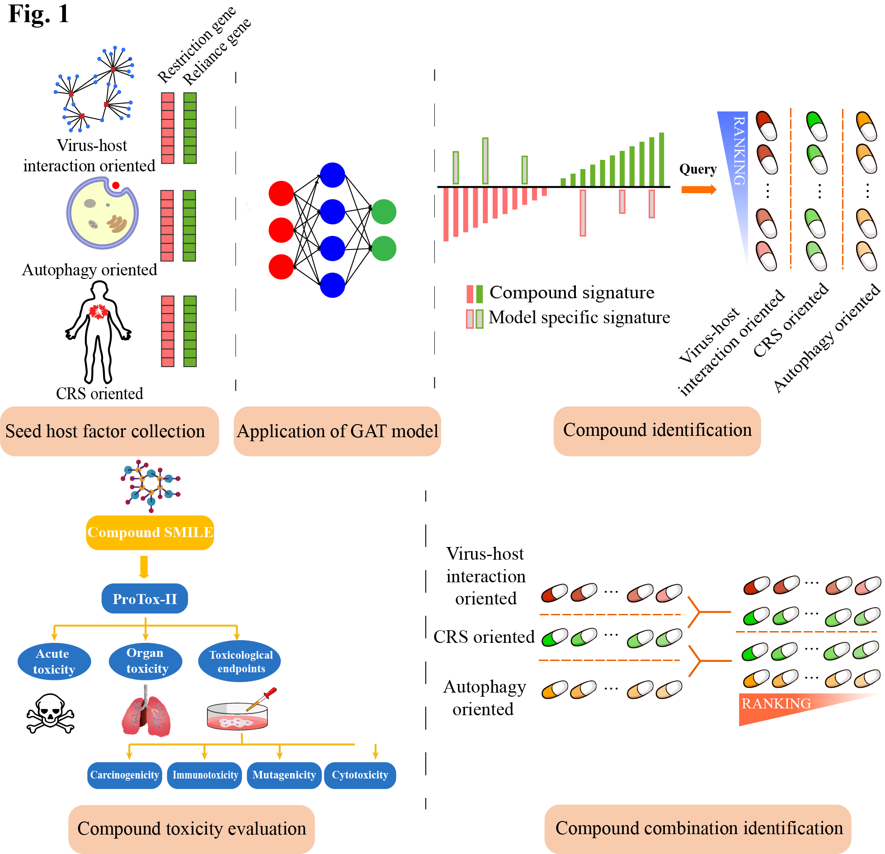

# iDMer: an integrative Data and Mechanism-driven epidemic response system for identifying compound interventions for sudden virus outbreak

iDMer is an **i**ntegrative **D**ata and **M**echanism-driven **e**pidemic **r**esponse system for addressing sudden virus outbreaks. The basic idea of iDMer is to identify compound interventions for any virus for which the genome is sequenced. It comprises 3 mechanism-driven compound identification modules, i.e. a virus-host interaction-oriented module, an autophagy-oriented module, and a cytokine release syndrome-oriented module. Further, as a one-stop integrative platform, iDMer incorporates compound toxicity evaluation and compound combination identification for virus treatment with clear mechanisms.

#### Authors:
Zhiting Wei, Yuli Gao and Fangliangzi Meng and Qi Liu

#### Citation:
iDMer: an integrative Data and Mechanism-driven epidemic response system for identifying compound interventions for sudden virus outbreak, submitted, 2020.

## Dependencies

#### Required Software:
* [dgl](https://www.dgl.ai/)
* [pytorch](https://pytorch.org/)
* [scikit-learn](https://scikit-learn.org/stable/index.html)
* [miniconda2](https://docs.conda.io/en/latest/miniconda.html)
* [miniconda3](https://docs.conda.io/en/latest/miniconda.html)
* [cmapPy](https://clue.io/cmapPy/index.html)
* [deepDDI](https://bitbucket.org/kaistsystemsbiology/deepddi/src/master/)
* [ProTox-II](http://tox.charite.de/protox_II)
* [HVPPI](http://zzdlab.com/hvppi/)
* [biopython](https://biopython.org/)

## Installation
#### Install via docker, highly recommended
Docker image of iDMer is available at https://hub.docker.com/r/bm2lab/idmer/.
if you have docker installed, you can pull the image:

        docker pull bm2lab/idmer

#### Install from source, not recommended. 
Please download the deepDDI and HVPPI tool, and place `run_DeepDDI.py` and `doc2vec_rf.py` in the corresponding directory.

        git clone https://github.com/bm2-lab/iDMer.git

## Usage
iDMer has two modes for use, i.e., `exp` and `denovo` mode.

In `exp` mode, user needs to provide virus VTPs reliance and restriction genes, EHFs reliance and restriction genes, as these genes are experimentally validated.   
In `denovo` mode, iDMer predicts the VTPs based on virus genome information. User needs to provide virus genome information and candidate VTPs in fasta format. A config file is also required to indicate the candidate VTPs reliance and restriction genes, the candidate EHFs reliance and restriction genes.
You can use these two mode by:

        python main.py exp --help

or

        python main.py denovo --help

## User Manual
For detailed information about usage, input and output files, test examples and data preparation, please refer to the [iDMer User Manual](/doc/iDMer_User_Manual.md)

## Contact
Zhiting Wei 1632738@tongji.edu.cn  
Qi Liu qiliu@tongji.edu.cn  
Tongji University, Shanghai, China

## iDMer flowchart

